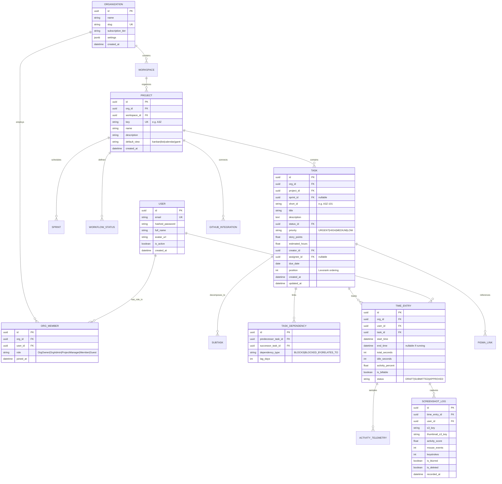

# System Architecture & Technical Blueprint
## Project Name: A3Zen Backend Core

---

## 1. Domain-Driven Directory Layout

```
a3zen/
├── docs/
│   ├── SRS.md                         # System Requirement Specification
│   ├── AI_LOOP_ENGINEERING.md         # 5-Gate AI & Context Engineering Pipeline
│   └── ARCHITECTURE.md                # System Architecture & Database Schemas
├── src/
│   ├── main.py                        # FastAPI Application Entrypoint & Lifespan
│   ├── config.py                      # Pydantic BaseSettings & Environment Config
│   ├── core/                          # Cross-Cutting Infrastructure
│   │   ├── database.py                # Async SQLAlchemy Engine & Session Factory
│   │   ├── redis.py                   # Async Redis Client & Connection Pools
│   │   ├── security.py                # Password Hashing, JWT (RS256/HS256) & Auth Guards
│   │   ├── rbac.py                    # Role-Based Access Control Middleware & Decorators
│   │   ├── exceptions.py              # Unified Domain & HTTP Exception Handlers
│   │   └── websockets.py              # WebSocket Connection Manager & Redis Pub/Sub Router
│   ├── models/                        # Declarative SQLAlchemy 2.0 Async Models
│   │   ├── base.py                    # TimestampedModel & TenantScopedModel
│   │   ├── auth.py                    # User, Organization, Workspace, OrgMember, RefreshToken
│   │   ├── project.py                 # Project, Sprint, Milestone, WorkflowStatus
│   │   ├── task.py                    # Task, Subtask, ChecklistItem, TaskDependency, Tag
│   │   ├── time_tracking.py           # TimeEntry, ActivityTelemetry, ScreenshotLog
│   │   └── integrations.py            # GitHubIntegration, FigmaLink, WebhookEventLog
│   ├── schemas/                       # Pydantic v2 Request / Response Models & Enums
│   │   ├── common.py                  # Pagination, Filtering, Standard API Response Envelope
│   │   ├── auth.py                    # Login, Register, TokenPayload, UserProfile
│   │   ├── project.py                 # ProjectCreate, ProjectUpdate, ProjectResponse
│   │   ├── task.py                    # TaskCreate, TaskMove, TaskFilter, DependencySchema
│   │   ├── views.py                   # KanbanViewResponse, GanttTimelineResponse, CalendarResponse
│   │   ├── time_tracking.py           # StartTimer, StopTimer, TelemetryIngest, ScreenshotUpload
│   │   ├── integrations.py            # GitHubWebhookPayload, FigmaEmbedRequest
│   │   └── websockets.py              # WSEventMessage, RoomSubscriptionPayload
│   ├── repositories/                  # Generic & Specialized Async DB Repositories
│   │   ├── base.py                    # BaseRepository (CRUD, Tenant Scoped filtering)
│   │   ├── user_repo.py
│   │   ├── project_repo.py
│   │   ├── task_repo.py
│   │   └── time_repo.py
│   ├── services/                      # Pure Business Logic Layer
│   │   ├── auth_service.py
│   │   ├── project_service.py
│   │   ├── task_service.py
│   │   ├── view_service.py            # Kanban, Gantt, Calendar Aggregations & CPM calculations
│   │   ├── time_service.py            # Telemetry computation & Timesheet reconciliation
│   │   ├── github_service.py          # Webhook verification, branch parsing & status sync
│   │   ├── figma_service.py           # oEmbed resolve & frame preview fetcher
│   │   └── ai_pipeline_service.py     # 5-Gate AI execution & context engine
│   └── api/                           # FastAPI APIRouters (v1)
│       ├── v1/
│       │   ├── api_router.py          # Unified v1 Router aggregation
│       │   ├── auth.py
│       │   ├── organizations.py
│       │   ├── projects.py
│       │   ├── tasks.py
│       │   ├── views.py               # /views/kanban, /views/calendar, /views/gantt
│       │   ├── time_tracking.py       # Timer & Desktop Companion Ingestion APIs
│       │   ├── integrations.py        # /integrations/github/webhook, /integrations/figma
│       │   └── ws.py                  # /ws/realtime (WebSocket endpoint)
└── tests/                             # Test-Driven Development (TDD) Suite
    ├── conftest.py                    # Pytest Async Engine, Test Client & DB fixtures
    ├── factories/                     # FactoryBoy / Async Fixture generators
    ├── unit/
    │   ├── test_rbac.py
    │   ├── test_task_dependencies.py
    │   ├── test_gantt_cpm.py
    │   └── test_activity_telemetry.py
    └── integration/
        ├── test_auth_api.py
        ├── test_projects_api.py
        ├── test_tasks_crud.py
        ├── test_views_api.py
        ├── test_time_tracking_api.py
        ├── test_github_webhook.py
        └── test_websocket_realtime.py
```

---

## 2. Relational Database Schema (PostgreSQL 16)



---

## 3. Real-Time WebSocket Protocol

### 3.1 Connection & Authentication
- **Endpoint:** `GET /api/v1/ws/realtime?token=<JWT_ACCESS_TOKEN>`
- **Handshake:** Authenticates JWT token, maps connection to `user_id` and `org_id`, initializes subscription set in Redis.

### 3.2 Subscription Channel Topology
Clients send JSON frames to join or leave specific entity rooms:
- **Project Room:** `room:org:{org_id}:project:{project_id}`
- **Task Room:** `room:org:{org_id}:task:{task_id}`
- **User Presence Channel:** `presence:org:{org_id}`

### 3.3 Event Schema
```json
{
  "event_id": "evt_7831fa",
  "channel": "room:org:org_9841:project:prj_e9801",
  "event_type": "TASK_MOVED",
  "actor": {
    "user_id": "usr_c398df1",
    "name": "Sarah Connor"
  },
  "timestamp": "2026-08-27T09:50:00Z",
  "payload": {
    "task_id": "tsk_10928a",
    "short_id": "A3Z-42",
    "previous_status_id": "st_in_progress",
    "new_status_id": "st_in_review",
    "new_position": 1050
  }
}
```

---

## 4. Desktop Tracker & Screenshot Telemetry Protocol

### 4.1 Ingestion Flow
1. **Device Pairing:** User logs into desktop agent $\to$ Backend issues cryptographically signed `device_token` with device hardware fingerprint.
2. **Heartbeat (Every 30s):** Desktop agent sends activity summary:
   ```json
   {
     "device_token": "dev_tok_991823",
     "active_time_entry_id": "te_55418",
     "period_start": "2026-08-27T09:40:00Z",
     "period_end": "2026-08-27T09:40:30Z",
     "keystroke_count": 84,
     "mouse_distance_px": 1420,
     "active_window_title": "VS Code - src/main.py",
     "is_idle": false
   }
   ```
3. **Screenshot Upload Request:** Desktop agent calls `POST /api/v1/time-tracking/screenshots/presigned-url` $\to$ Backend generates secure presigned AWS S3 / Cloudflare R2 PUT URL with 5-minute expiry $\to$ Desktop streams image directly to storage $\to$ Desktop calls `POST /api/v1/time-tracking/screenshots/confirm` with metadata.

---

## 5. Test-Driven Development (TDD) Strategy & Phase Plan

| Phase | Target Deliverable | Test Focus |
| :--- | :--- | :--- |
| **Phase 1** | Project Setup & Configuration | Settings validation, DB connectivity, Async Redis pool fixtures |
| **Phase 2** | Auth, Security & Multi-Tenant RBAC | JWT lifecycle, Password hashing, Role permissions matrix, Tenant isolation |
| **Phase 3** | Projects, Workflows & Task Engine | CRUD, Lexorank reordering, Subtasks, CPM Dependency graphs |
| **Phase 4** | Real-Time WebSocket & Redis Pub/Sub | Connection handshake, Room subscriptions, Event broadcasting, Echo prevention |
| **Phase 5** | Views Engine (Kanban, Calendar, Gantt) | Aggregation queries, Date range filters, Critical path recalculation |
| **Phase 6** | Time Tracking & Desktop Activity Engine | Timer start/stop, Telemetry computation, Idle deductions, Presigned S3 links |
| **Phase 7** | External Integrations (GitHub & Figma) | Webhook signature verification, Branch parsing, oEmbed parsing |
| **Phase 8** | 5-Gate AI Engine Pipeline | Intent parser, Context builder, Test generator, Automated TDD validation loop |
