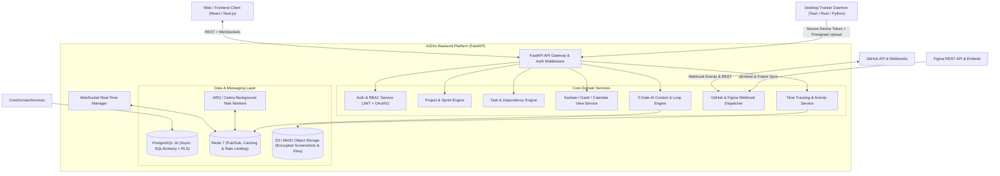

# System Requirement Specification (SRS)
## Project Name: A3Zen (Enterprise AI-Driven Project & Time Management Platform)
**Version:** 1.0.0  
**Status:** Approved Specification  
**Architecture Paradigm:** Backend-First, Domain-Driven, Multi-Tenant SaaS with 5-Gate AI Loop Engineering & TDD  

---

## 1. Executive Summary & Vision

### 1.1 Product Vision
**A3Zen** is an all-in-one, modern project management and workforce intelligence platform engineered for agile software teams, agencies, and distributed enterprises. It merges:
1. **High-Velocity Issue & Sprint Management** (Linear clarity + Jira workflow power + ClickUp multi-view flexibility).
2. **Real-Time Visual Collaboration** (Live Kanban, interactive multi-month Gantt/Timeline with auto-scheduling dependencies, and responsive drag-and-drop Calendars).
3. **Automated Ecosystem Integrations** (Bidirectional GitHub PR/branch/commit hooks & Figma live canvas embeds).
4. **Time & Activity Tracking Companion Engine** (Hubstaff/Time Doctor-grade optional desktop companion daemon for randomized/periodic screenshot capture, activity intensity indices, idle time detection, and timesheet approvals).
5. **Autonomous 5-Gate AI Engineering Pipeline** (Context-aware task decomposition, automated test generation, PR review synthesis, and continuous TDD verification).

### 1.2 Target Audience & Monetization Model
- **Primary Market:** Tech startups, software engineering agencies, hybrid/remote product teams, and B2B enterprise SaaS clients.
- **Tenancy Model:** Multi-tenant shared database with Row-Level Security (RLS) and Tenant Scoping Middleware, ready for multi-organization billing, custom domains, and enterprise tier isolation.

---

## 2. System Architecture & High-Level Design

---

## 3. Detailed Functional Requirements

### 3.1 Multi-Tenant Organization & Hierarchy Model

| Entity | Description | Rules & Constraints |
| :--- | :--- | :--- |
| **Organization (Tenant)** | Root billing and governance entity | Identified by unique slug, holds subscription tier, storage quotas, and security policies. |
| **Workspace** | Department or business unit level container (e.g. Engineering, Product, Marketing) | Contains teams, projects, global tags, and workspace-level integrations. |
| **Project** | Core delivery container with distinct workflow states, custom fields, and access levels | Supports Sprint cycles, backlog, and customizable status pipelines (To Do, In Progress, Review, Blocked, Done). |
| **Sprint / Cycle** | Time-boxed development window | Has start date, end date, sprint goals, velocity metrics, and burndown computation. |
| **Task / Issue** | Primary unit of work | Contains UUID, short identifier (e.g., `A3Z-1042`), title, rich markdown description, status, priority (Urgent, High, Medium, Low), estimate (points/hours), assignees, due date, parent/subtasks. |
| **Subtask & Checklist** | Granular execution units | Nested beneath parent tasks; inherits parent permissions; supports standalone checklist completion. |
| **Task Dependency** | Relational link between tasks | Types: `BLOCKS`, `BLOCKED_BY`, `RELATES_TO`, `DUPLICATES`. Gantt engine automatically recalculates critical path upon date shifting. |

---

### 3.2 View Engines

#### 3.2.1 Real-Time Interactive Kanban Board
- Dynamic columns mapped to project workflow statuses.
- Column-level WIP (Work In Progress) limit alarms.
- Drag-and-drop ordering with optimistic UI updates and WebSocket broadcast to all connected team members.
- Quick filters: Assignee, Priority, Label, Milestone/Sprint, Dependency state, Text search.

#### 3.2.2 Interactive Calendar View
- Multi-mode views: Month, Week, Multi-week, and Day views.
- Drag-and-drop event rescheduling with instant conflict alerts.
- Support for recurring tasks (Daily, Weekly on specific days, Monthly, Custom cron intervals).
- External iCal export and Google Calendar sync feed endpoint.

#### 3.2.3 Interactive List & Table View
- High-density data grid with multi-column sorting, grouping (by Status, Assignee, Priority, Sprint), and filtering.
- Inline cell editing for instant updates.
- Configurable custom columns (Text, Number, Dropdown, Date, Formula, User multi-select).

#### 3.2.4 Gantt & Timeline View
- Interactive timeline bars with dependency connectors (arrows).
- Critical Path Method (CPM) calculation for project milestones.
- Milestone markers, parent-child collapsible trees, and drag-to-extend duration.

---

### 3.3 Time Tracking & Desktop Activity Ingestion Engine

#### 3.3.1 Time Tracking Core
- Start/stop active timers attached to specific tasks.
- Manual timesheet entry with approval workflows (Draft -> Submitted -> Approved / Rejected).
- Billable vs. Non-billable hourly rate tracking.

#### 3.3.2 Desktop Companion Agent Integration
- **Heartbeat & Activity Index:** Desktop agent sends 30-second activity telemetry (keystroke count, mouse movement delta, active window process name) to compute % activity intensity without recording keylogs (privacy-preserving).
- **Periodic Screenshot Capture:**
  - Configurable random or fixed intervals (e.g. 1 to 3 screenshots per 10-minute block).
  - Presigned S3 upload URLs with direct client-to-storage streaming.
  - Client-side or server-side automated blur option for sensitive content.
  - Instant deletion capability by employee with corresponding time deduction (privacy compliance).
- **Idle Detection:** Automatic timer pause when no user input is detected for configurable threshold (e.g., 5 minutes) with prompt to keep or discard idle time upon return.

---

### 3.4 External Integrations

#### 3.4.1 GitHub Integration
- **2-Way Webhook Processor:** Ingests `push`, `pull_request`, `issue_comment`, and `workflow_run` events.
- **Smart Branch Linking:** Automated task matching via branch format `feature/A3Z-1024-title` or commit message `fixes A3Z-1024`.
- **Workflow State Automation:**
  - PR Opened → Task moves to `In Review`.
  - PR Merged → Task moves to `Done` or `Ready for QA`.
  - PR Draft → Task moves to `In Progress`.
- **Embedded PR Details:** PR review status, check run results (CI passing/failing), and reviewer approvals visible directly in task view.

#### 3.4.2 Figma Integration
- **oEmbed & REST API sync:** Paste any Figma frame or file link into task description or attachments.
- **Live Frame Previews:** Backend fetches authenticated frame preview thumbnails via Figma API and caches them.
- **Deep Linking:** Direct one-click jump to the exact node ID in the Figma canvas.

---

### 3.5 Real-Time Synchronization & Presence Engine
- **FastAPI WebSockets + Redis Pub/Sub:**
  - Channel subscription scoped per Workspace / Project / Task.
  - Broadcast types: `TASK_UPDATED`, `TASK_MOVED`, `COMMENT_ADDED`, `TIMER_TICK`, `USER_PRESENCE` (who is viewing/editing this task), `NOTIFICATION_TRIGGERED`.
  - Automatic reconnection handling, message acknowledgment, and heartbeat pings.

---

### 3.6 Authentication, Security & Multi-Tenant RBAC

- **Authentication:**
  - Access Token (Short-lived JWT, RS256 or HS256 with 15-minute expiry).
  - Refresh Token (Cryptographically secure random token, stored in Redis/DB with rotation and revocation on logout).
  - OAuth2 Social Logins: GitHub and Google SSO.
- **Role-Based Access Control (RBAC):**
  - `SuperAdmin` (Platform owner, global metrics, tenant management).
  - `OrgOwner` (Organization creator, billing, tenant settings, member invites).
  - `OrgAdmin` (Workspace configuration, global project administration).
  - `ProjectManager` (Project workflows, sprint management, timesheet approvals).
  - `Member` (Task creation, assigned task updates, timer tracking).
  - `Guest/Client` (Read-only or restricted comment-only access to designated projects).
- **Tenant Isolation:**
  - Every SQL query automatically filters by `tenant_id` / `org_id` injected via authenticated context middleware.
  - Pre-signed S3 storage keys strictly isolated: `/{org_id}/{project_id}/attachments/{file_id}`.

---

## 4. Non-Functional Requirements

### 4.1 Performance & Scalability
- **API Latency:** P95 response time under 100ms for read endpoints; P95 under 200ms for write endpoints under normal load.
- **Real-Time Event Propagation:** WebSocket broadcast latency under 50ms from publish to subscriber receipt.
- **Concurrency:** Support minimum 5,000 concurrent WebSocket connections per backend pod.

### 4.2 Security & Compliance
- **OWASP Top 10** compliance (input sanitization, prepared statements, rate limiting on auth endpoints).
- **Data Protection:** Encrypted at rest (AES-256) and in transit (TLS 1.3).
- **Audit Logging:** Immutable audit trail for all sensitive operations (role changes, permissions, time adjustments, screenshot deletions).

---

## 5. Technical Stack Matrix

| Layer | Technology | Rationale |
| :--- | :--- | :--- |
| **Backend Core** | Python 3.12+ / FastAPI | High asynchronous I/O performance, Pydantic v2 validation, native async ecosystem. |
| **ORM & Database** | SQLAlchemy 2.0 (Async) + PostgreSQL 16 | Strict typing, robust relational integrity, JSONB support for dynamic custom fields. |
| **Migrations** | Alembic | Version-controlled declarative database schema evolutions. |
| **Cache & Pub/Sub** | Redis 7 | Sub-millisecond distributed pub/sub for WebSockets and session/cache management. |
| **Task Queue** | ARQ / Celery with Redis backend | Asynchronous background processing for webhooks, email digests, and screenshot thumbnails. |
| **Object Storage** | S3 API (AWS S3 / Cloudflare R2 / MinIO) | Scalable, pre-signed upload security for screenshots and assets. |
| **Testing Suite** | Pytest, Pytest-Asyncio, HTTPX, FactoryBoy | Complete Test-Driven Development (TDD) automated verification. |
